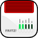

<p align="center">
    
</p>

<span align="center">

# FRITZ!Box for Homebridge


</span>


## Description

Work in progress

This [Homebridge](https://homebridge.io) plugin exposes some FRITZ!Box features to Apple HomeKit. Currently supported are switches for WLAN, configured answering machines and call deflections. Smart home devices connected to the FRITZ!Box may also be exposed as HomeKit devices<sup>1</sup>.


## Configuration

I recommend using [Homebridge UI](https://github.com/homebridge/homebridge-config-ui-x) to configure the plugin

```
"platforms": [
    ...
    {
        "platform": "FRITZ!Box",
        "name": "FRITZ!Box",
        "username": <username>,
        "password": <password>,
        "services": {
            "WLAN": <"none"|"guest"|"all">,
            "TAM": <true|false>,
            "CallDeflection": <true|false>,
            "SmartHome": <true|false>
        },
        "update": {
            "fritzbox": <seconds>,
            "smarthome": <seconds>
        },
        "advanced": {
            "host": <IP>,
            "SSL": <true|false>
        }
    }
]
```

Option | Description | Default
------ | ----------- | -------
**username** | Your FRITZ!Box username (if any) | -
**password** | Your FRITZ!Box password (if any) | -
**services.WLAN** | Create switches for selected WLANs | guest
**services.TAM** | Create switches for each configured answering machine | true
**services.CallDeflection** | Create switches for each configured call deflection | true
**services.SmartHome<sup>1</sup>** | Expose smart home devices connected to the FRITZ!Box as HomeKit devices | true
**update.fritzbox<sup>2</sup>** | Time in seconds to update the state of FRITZ!Box switches (WLAN, TAM, etc.) | 60
**update.smarthome<sup>2</sup>** | Time in seconds to update the state of smart home devices | 15
**advanced.host** | The IP of your FRITZ!Box, if you want to bypass auto discovery | -
**advanced.SSL** | Whether to use SSL encrypted connections. *Note: the self-signed certificate of the FRITZ!Box usually won't work*| false

<small><sup>1</sup> As written above: work in progress. I only have some FRITZ!DECT 200 to test and these work. Everything else might work, but no guarantee.</small>

<small><sup>2</sup> Updating the state of a FRITZ!Box and connected smart home devices is expensive in terms of network traffic and CPU use. I chose reasonable default values for the refresh rate.
However, a contact sensor *(not implemented yet anyway)* which only updates every 15 seconds is probably not what you want. In this case you may wish to adjust the settings.
But remember ... the main duty of a FRITZ!Box **is not** to answer countless requests of some random Homebridge plugin.</small>


## Note

I'd like to keep this plugin as simple as possible. So I may not implement features that can be achieved either through HomeKit automations, shortcuts or with the help of other Homebridge plugins.
